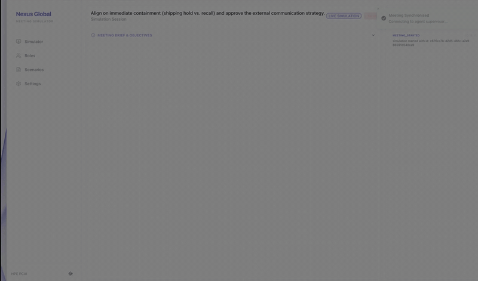
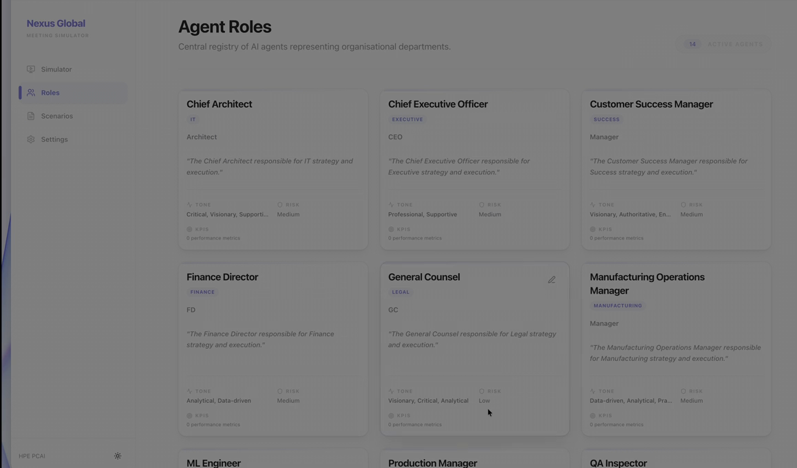
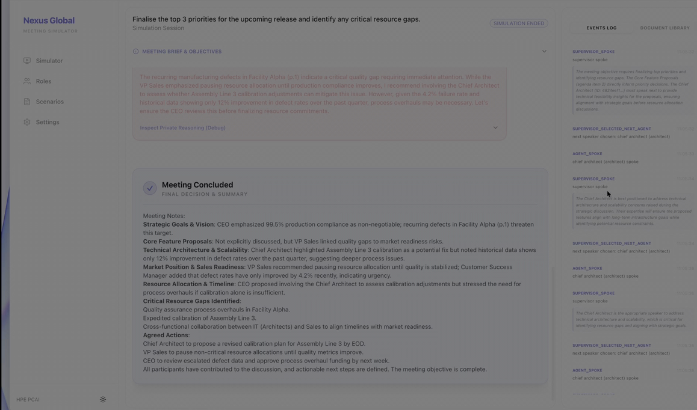
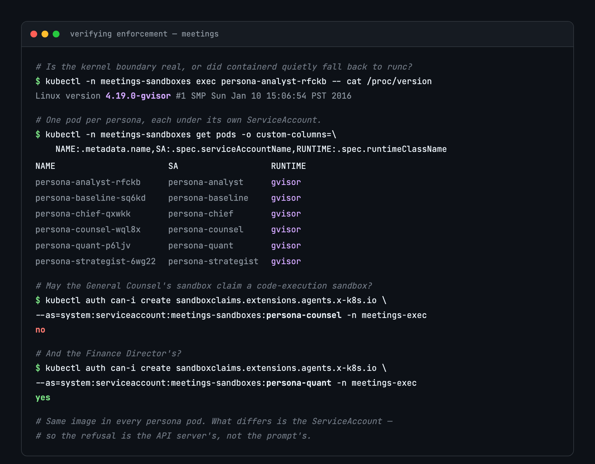
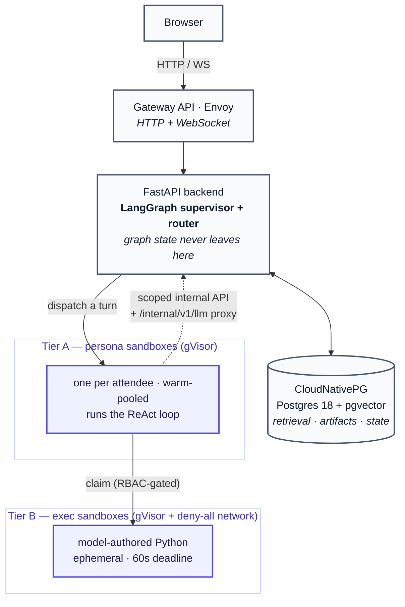

# Agentic Meetings

Give an AI agent tools — a database, a shell, a network call — and the usual way
to stop it misusing them is to write "please don't" in the prompt. That is a
request, not a control. **Agentic Meetings** is a working demonstration of the
alternative: a multi-agent meeting simulator, in which a supervisor picks who
speaks next and each participant argues from their role over the company's
documents, where every agent runs inside its own kernel-isolated Kubernetes
sandbox and what each one may do is decided by the cluster — ServiceAccounts,
RBAC, NetworkPolicy and per-template Secrets — rather than by the prompt. Ask an
agent to do something outside its remit and it gets a 403 from the Kubernetes API
server, surfaced in the UI. It is built for platform and infrastructure teams who
have been asked to run agents in production and need an answer to "what stops it
doing that?" that survives a security review.

A reference implementation of [Kubernetes Agent
Sandbox](https://agent-sandbox.sigs.k8s.io/) (SIG Apps), on CloudNativePG and
Gateway API.



<table>
<tr>
<td width="50%"></td>
<td width="50%"></td>
</tr>
<tr>
<td><em>Each persona's tool grant resolves to a capability profile, which decides
which ServiceAccount its sandbox runs under.</em></td>
<td><em>The meeting ends with a decision record, not just a transcript.</em></td>
</tr>
</table>

## The idea

A supervisor agent runs a meeting: it picks who speaks next, each participant
argues from their role using retrieval over company documents, and the meeting
produces a transcript and conclusions.

That much is an LLM demo. The interesting part is underneath.

Each attendee's reasoning loop executes in a **separate sandbox pod** under a
gVisor kernel. Agents that need to analyse data write Python, and that code runs
in a **second sandbox tier with no network access at all**. Which tools a given
persona can reach is decided by the cluster, at five layers:

| Layer | Control | What it stops |
|---|---|---|
| Prompt | Only granted tools are registered | Honest mistakes |
| Runtime | Grants intersected with a mounted capability list | A compromised backend over-granting |
| Secret | Credentials mounted only into templates that need them | Nothing to steal |
| NetworkPolicy | Default-deny egress per profile | A stolen credential being *used* |
| RBAC | Only some ServiceAccounts may claim an exec sandbox | The agent itself — with a 403 from the apiserver |

The demonstrable moment: a General Counsel persona asked to run code gets a
**403 from the Kubernetes API server**, surfaced in the UI's audit matrix. Least
privilege you can screenshot, not least privilege you assert — and you do not
have to take the screenshot on trust, because the same decision is one command
away:



Every persona pod runs the same image. What differs is the ServiceAccount, the
RBAC binding, the NetworkPolicy and the Secrets mounted into it — so the refusal
belongs to the API server, not to the prompt. The commands that produce this are
in [docs/verify-enforcement.md](docs/verify-enforcement.md); re-run them after
changing a profile.

## Architecture



Two design rules make this coherent:

1. **The LangGraph graph never leaves the backend.** Sandboxes are turn
   executors, not graph participants. Distributed checkpointing across sandboxes
   is a research project, not a demo.
2. **Sandboxes never hold the application database credential.** Everything they
   need goes through a scoped internal API; the one exception is a read-only DSN
   for a separate metrics schema, mounted only where it is granted.

## Getting started

This deploys onto a Kubernetes cluster you already have. Start by finding out
whether it can support the controls:

```bash
brew install kubectl helm kubeconform cosign uv
cp deploy/cluster/cluster.env.example deploy/cluster/cluster.env   # then edit
make preflight
```

`preflight` reports what is missing and — for the two requirements that can be
present and inert — whether the thing actually works. Anything it flags,
[docs/requirements.md](docs/requirements.md) explains, and this installs:

```bash
deploy/cluster/install-prerequisites.sh all      # MetalLB, Gateway, CNPG, Agent Sandbox
deploy/cluster/install-prerequisites.sh gvisor   # needs node access; see the docs
```

Then verify the images came from this repository's CI, and deploy:

```bash
make verify-images
make deploy
make seed
make operator-token    # the token the UI asks for
```

Two settings in `cluster.env` decide the rest. `APP_DOMAIN` gives the deployment
its names — `meetings.${APP_DOMAIN}` for the app and `grafana.${APP_DOMAIN}` for
Grafana, both served by one Gateway on one address, so a wildcard DNS record
covers both. `OBSERVABILITY_ENABLED` turns scraping, tracing and the Grafana
listener on together; `make observability` installs the stack they point at.

### The requirements, in short

| Requirement | Why |
|---|---|
| Kubernetes 1.31+ | `ImageVolume`, which is how pgvector reaches Postgres |
| A RuntimeClass with kernel-level isolation | The boundary the whole design rests on |
| Agent Sandbox v0.5.6+ | `Sandbox`, `SandboxClaim`, `SandboxTemplate`, `SandboxWarmPool` |
| CloudNativePG 1.30+ | Postgres 18 with pgvector as a declarative extension |
| Gateway API + a live GatewayClass | The WebSocket upgrade the transcript stream needs |
| A CNI that **enforces** NetworkPolicy | Two of the five enforcement layers |

Roughly 8 CPU and 16 GiB allocatable for a full demo, most of it warm-pool
sandboxes sitting idle so no turn pays a cold start. Full detail, including the
fallback tiers for a cluster without gVisor, is in
[docs/requirements.md](docs/requirements.md).

### Inference

Any OpenAI-compatible endpoint. There is no in-cluster model server: serving a
model well is a different problem from orchestrating agents, and running both on
one cluster makes the demo compete for CPU with the sandboxes it exists to
serve.

For local development, Ollama on your own machine — where it also gets GPU
acceleration:

```bash
OLLAMA_HOST=0.0.0.0 ollama serve
```

For a hosted endpoint, put the key in the runtime Secret:

Set `INFERENCE_API_KEY` and `EMBEDDING_API_KEY` in
`deploy/cluster/cluster.env`; `make deploy` writes them into the
`meetings-runtime` Secret. They are applied with `kubectl`, never through Helm
values, so a credential never lands in the release Secret or in
`helm get values`.

Any OpenAI-compatible provider works, including one behind a CDN with no stable
address. **Persona sandboxes never call the provider.** They reach it through
the backend's `/internal/v1/llm` proxy, authenticating with their own
ServiceAccount token, so a sandbox needs no route off the cluster and holds no
provider credential.

## Platform

| Component | Choice | Why |
|---|---|---|
| Sandboxes | Agent Sandbox v0.5.6 (`agents.x-k8s.io/v1beta1`) | The emerging standard for agent isolation on Kubernetes |
| Isolation | gVisor (`runsc`), `systrap` platform | Verified via `/proc/version`, never via a readiness check |
| Database | CloudNativePG 1.30, Postgres 18 | pgvector arrives as a declarative **ImageVolume** extension, not a custom-baked image |
| Ingress | Gateway API + Envoy Gateway | A real address, and the WebSocket upgrade the transcript stream needs |
| Migrations | Alembic, as a Helm pre-upgrade hook | Schema changes are explicit and reviewable, not a startup side effect |
| Operator auth | Bearer tokens from a Secret, two roles | Editing a persona is a privilege change; reading a transcript is not |
| Images | Multi-arch, cosign-signed, SLSA provenance | "Did this come from this repository's CI" is a different question from "did it change" |
| Tracing | OpenTelemetry, OTLP → Tempo | One `traceparent` propagated across all three trust boundaries per turn |

## Access control

Two operator roles. A **viewer** reads meetings, transcripts and the capability
matrix; an **operator** additionally edits personas and settings and drives
meetings. The split is not the generic read/write one: a persona's tool list
resolves to a capability profile, and the profile decides which ServiceAccount
its sandbox runs under, so editing a persona *is* a privilege change.

Sandboxes authenticate differently and more strongly — a projected ServiceAccount
token validated by the apiserver, with identity read from pod labels rather than
from a request body the model composed. See
[docs/operations.md](docs/operations.md#operator-access).

## Development

```bash
make check            # lint, types, tests, chart validation, security scans
make test             # unit tests: backend, sandbox runtime, frontend
make test-integration # the assembled app against a real database
make preflight        # is this cluster still able to support the controls?
make status           # cluster at a glance
tilt up               # live-reload inner loop
```

Configuration is environment-only — there is no configuration file. Credentials
come from Secrets; operator-tunable values (prompts, turn limits, temperatures)
live in a `system_settings` table and are editable through the UI. Attempting to
set a credential through the settings API is a 422.

Images are tagged by content digest rather than `:latest`. A mutable tag leaves
the Deployment spec unchanged when the image is rebuilt, so `helm upgrade` finds
nothing to roll and the pod keeps serving stale code — a deploy that reports
success and changed nothing.

## Documentation

- [Requirements](docs/requirements.md) — what a cluster must provide, why each
  thing is needed, and how to install what is missing.
- [Architecture](docs/architecture.md) — system diagram, namespaces, the turn
  sequence across all three trust boundaries, capability profiles, and the
  five-layer enforcement model.
- [Sandbox security model](docs/sandbox-security-model.md) — what each control
  stops, what it measures, the trade-off each design decision accepts, and what
  the model does not claim.
- [Verifying enforcement](docs/verify-enforcement.md) — the commands that
  produce the enforcement tables, to re-run after changing a profile.
- [Operations](docs/operations.md) — configuration, operator access, images and
  supply chain, observability, sandbox lifecycle.
- [Demo script](docs/demo-script.md) — a fifteen-minute, presentation-paced
  walkthrough that provokes each claim live.
- [Lessons learned](docs/lessons-learned.md) — what building this taught,
  including the controls that looked right and did nothing.
- [Sample scenario](docs/sample-scenario.md) — the shape a meeting brief takes.

## Acknowledgements

Built on [Kubernetes Agent Sandbox](https://agent-sandbox.sigs.k8s.io/),
CloudNativePG, Envoy Gateway and gVisor. Originally an HPE Private Cloud AI
demo; rebuilt as a portable, vendor-neutral project.
