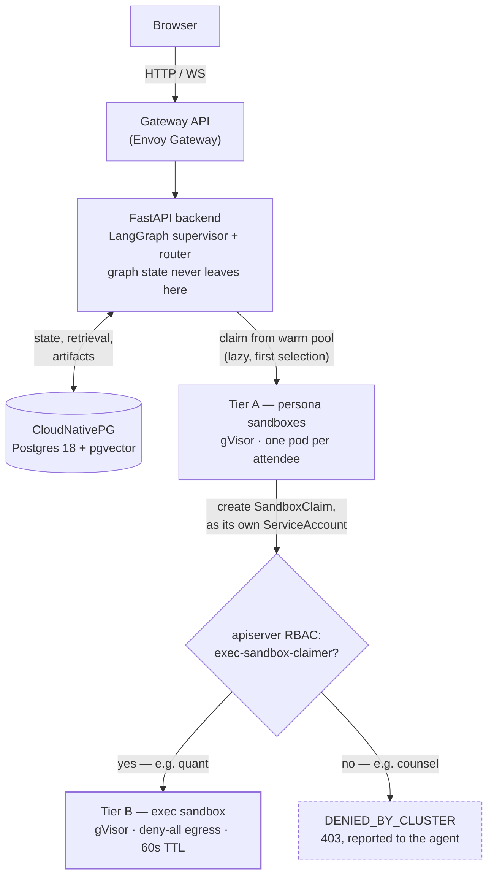
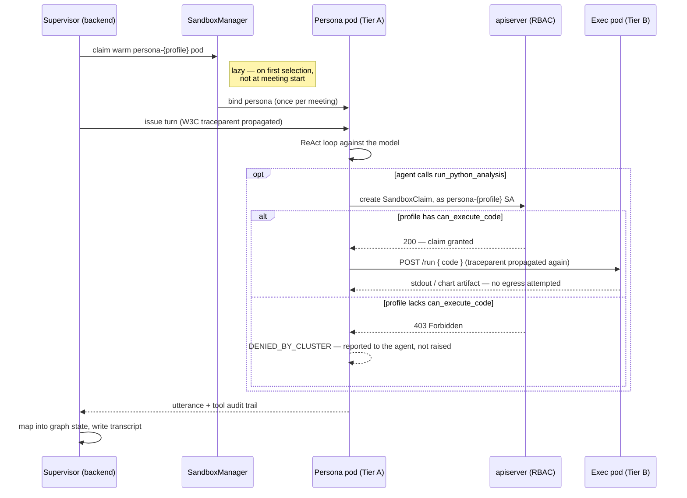
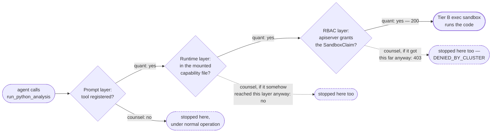

# Architecture

The system in one property: a meeting turn crosses three trust boundaries —
backend, persona sandbox, exec sandbox — and what a given persona may do at
each one is decided by Kubernetes objects, not by the prompt. This document is
the consolidated reference for how the pieces fit together. For narrower
questions, see the companion docs:

- [`requirements.md`](requirements.md) — what a cluster must provide before
  any of this applies, and how to check it.
- [`sandbox-security-model.md`](sandbox-security-model.md) — what each control
  stops, what it measures, and what the model does not claim.
- [`operations.md`](operations.md) — configuration, operator access, images
  and supply chain, observability, sandbox lifecycle.
- [`verify-enforcement.md`](verify-enforcement.md) — the exact commands that
  produce the enforcement table below; re-run them after changing a profile.
- [`demo-script.md`](demo-script.md) — a presentation-paced walkthrough that
  provokes each of these claims live.

## System overview



Two design rules make this coherent, and neither is negotiable in an
extension of the system:

1. **The LangGraph graph never leaves the backend.** Sandboxes are turn
   executors, not graph participants. Distributed checkpointing across
   sandboxes is a research project, not a demo requirement — see
   `backend/app/orchestration/agents.py`, whose docstring records that a
   remote ReAct loop cost one round trip per turn precisely because
   individual tool calls are not RPC'd back to the backend.
2. **Sandboxes never hold the application database credential.** Everything
   a persona sandbox needs goes through a scoped internal API back to the
   backend; the one exception is a read-only DSN for a separate metrics
   schema, mounted only into profiles that are granted it.

## Namespaces

| Namespace | Holds | Notes |
|---|---|---|
| `meetings` | Backend, frontend, Gateway, CloudNativePG cluster | Holds the application database credential. Nothing here is gVisor-isolated because nothing here runs untrusted code. |
| `meetings-sandboxes` | Tier A — one persona pod per attendee, warm-pooled per profile | Each pod's ServiceAccount (`persona-{profile}`) is what RBAC and NetworkPolicy actually key on. |
| `meetings-exec` | Tier B — the `exec-python` warm pool | Deny-all egress. Only reachable via a SandboxClaim a Tier A pod creates against its own ServiceAccount. |

Defined in [`deploy/charts/meetings/templates/namespaces.yaml`](../deploy/charts/meetings/templates/namespaces.yaml).

## The turn sequence



A few details that don't survive being summarized further:

- **Acquisition is lazy.** A five-person meeting where two attendees never
  speak should not hold five pods — the claim happens on the supervisor's
  first selection of that attendee, not at meeting start
  (`backend/app/sandbox/manager.py`).
- **The Tier B claim is made by the persona pod itself**, using the
  ServiceAccount token already mounted into it — the backend is not in this
  path and cannot broker around the RBAC decision on a persona's behalf
  (`sandbox/runtime/runtime/tools/code_exec.py`).
- **A denial is reported, not raised.** `run_python_analysis` catches the
  403, returns `DENIED_BY_CLUSTER: ...` as a normal tool result, and the
  agent carries on contributing. This is what makes the denial show up in
  the transcript and the audit matrix as a policy decision, rather than
  crashing the turn.
- **The trace survives all three hops.** The `traceparent` header is
  propagated over the sandbox RPC and again when a persona pod claims an
  exec sandbox, so one turn renders as one trace spanning all three trust
  boundaries (`backend/app/core/telemetry.py`).
- **Nothing durable lives in a sandbox.** If a pod is lost mid-meeting, the
  backend forgets the lease, claims a replacement, replays the persona bind
  and re-issues the turn — once. The `turn_results` table is what makes
  re-issuing safe; a second retry would hammer a genuinely empty warm pool
  with every attendee in sequence and stall the meeting rather than recording
  a failure the transcript can show.
- **A sandbox is held per persona, not per turn.** A warm pool is sized for
  concurrent speakers. Claiming per turn drains a pool of two by the third
  turn of a four-person meeting, and every attendee after that pays a cold
  gVisor start or fails outright.

## Capability profiles

A persona's requested tools resolve to the *smallest* profile that covers
them (`backend/app/orchestration/profiles.py`) — a persona that only needs to
read numbers lands in `analyst`, never in `quant`, because reading metrics is
not a reason to be handed a Python interpreter. A persona that asks for a
combination no profile provides fails meeting start with a precise
`ProfileDriftError` rather than silently losing a capability mid-meeting.

| Profile | Adds beyond baseline | Executes code | Metrics DSN | Corpus egress | Seeded as |
|---|---|:-:|:-:|:-:|---|
| `baseline` | — (retrieve, draft, read, record) | | | | — |
| `counsel` | `check_policy_compliance` | | | | General Counsel |
| `strategist` | `search_corpus` | | | ✅ | Architect |
| `analyst` | `query_business_metrics` | | ✅ | | VP |
| `quant` | metrics + `run_python_analysis` | ✅ | ✅ | | Finance Director |
| `chief` | metrics + policy + corpus | | ✅ | ✅ | CEO |

The `chief` row is deliberate, not an oversight: it is the broadest read
access of any profile and still cannot execute code. Seniority is not a
reason to hand someone a Python interpreter, and the contrast between
`chief` and `quant` is what makes the RBAC boundary legible rather than
merely a rule that happens to bind the CEO.

Every profile shares one runtime image. Nothing about the image decides what
an agent may do — only the SandboxTemplate, ServiceAccount, NetworkPolicy and
mounted Secrets its sandbox is created from.

## The five-layer enforcement model

| Layer | Control | Stops | Measured |
|---|---|---|---|
| Prompt | Only granted tools are registered | Honest mistakes | — |
| Runtime | Grant intersected with a capability file mounted from a ConfigMap | A compromised backend over-granting | `/etc/sandbox/capabilities` per pod |
| Secret | Credentials mounted only into templates that need them | Nothing to steal | absent for `baseline`/`counsel`, present for `analyst`/`quant`/`chief` |
| NetworkPolicy | Default-deny egress per profile; no route off-cluster at all | A stolen credential being *used* | blocked for `baseline`/`counsel`, open for `analyst`/`quant`/`chief` |
| RBAC | Only some ServiceAccounts may claim an exec sandbox | The agent itself — a 403 from the apiserver | **yes** for `quant` only, of six profiles |

The table lists each layer in isolation; the diagram below is the argument
for having five of them. It follows one tool call — `run_python_analysis` —
from two profiles that both attempt it, and shows that `counsel` is caught
independently at two different layers, not just the first one it meets:



`quant`'s path (solid) is what a normal turn does. `counsel`'s path (dashed)
shows what happens *if* an earlier layer were somehow defeated — a
compromised backend over-granting a tool, say — and the request kept going
anyway: two more layers, decided by two different systems (a ConfigMap and
the apiserver's RBAC), independently refuse it. No single bypassed layer is
enough.

Layers 3 and 4 compose the same way for data access: a persona with no metrics
credential also has no network route to reach Postgres, so a DSN leaked into a
prompt is useless to the wrong profile.

The reasoning behind each choice, and the trade-off each one accepts, is in
[`sandbox-security-model.md`](sandbox-security-model.md); the commands that
measure them are in [`verify-enforcement.md`](verify-enforcement.md).

### Why every profile may still reach the apiserver

Blocking apiserver egress for profiles without the code-execution grant sounds
like defence in depth. It is marginally stronger and clearly worse: the refusal
arrives as a 60-second connection timeout rather than a 403, and a policy
decision becomes indistinguishable from an outage.

RBAC is the authoritative control, so the request is allowed to reach the
apiserver and be refused there — fast, unambiguous, reportable by the agent and
displayable in the audit matrix. A denial nobody can see is a control nobody can
trust.

## Reaching the model

Every model call in the system goes through the backend. Persona sandboxes have
no route off the cluster and hold no provider credential: they call
`/internal/v1/llm` on the backend, authenticated by their own ServiceAccount
token, and the backend — which is not sandboxed — forwards to the configured
endpoint with the real key.

That replaced a direct path guarded by an ipBlock list of the endpoint's
addresses. NetworkPolicy matches addresses and a CDN-fronted provider has no
stable ones, so the only rule that worked was `0.0.0.0/0` — the whole internet,
granted to the least-trusted component in the system in order to reach one host.
Proxying removed both the setting and that trade.

### Assume nothing about the provider

Every provider claims the same OpenAI-compatible API and none implement the same
subset. Within one week this project met a provider that rejects `json_schema`
outright, one that accepts it and returns an empty body, one that gzips a
response the caller was told was plain JSON, one that treats
`reasoning_effort: "none"` as a reason to answer nothing, one that reasons for
the entire output budget and is truncated mid-tool-call, and one that writes its
tool call out as `<tool_call><arg_key>…` markup the serving stack never parses.

Each was first fixed where it was found, and each fix encoded an assumption
about one provider. [`llm_call.py`](../backend/app/orchestration/llm_call.py)
stops guessing. A structured call climbs progressively more permissive
strategies and the first usable answer wins:

| Rung | Requires | Used when |
|---|---|---|
| `tools` | tool calling | always tried first — the most widely implemented structured mode |
| `tools_retry` | tool calling | only after `finish_reason=length`, with a larger budget |
| `text` | nothing but text generation | the floor; parsed out of the body |

Plain text is the floor deliberately: a provider that cannot do it is not a chat
model. Nothing in the ladder requires support beyond generating text, and richer
support is used when it is there.

A reply that fails strict validation is not the same as a model that said
nothing useful, so `recovery.salvage_decision` reads the encodings models
actually use — bare JSON, fenced JSON, `<arg_key>`/`<arg_value>` pairs,
`<function=…>`. Prose is deliberately *not* mined: an id merely mentioned while
reasoning about someone else must never become the routing decision.

### Failures name themselves

Every rung is recorded whether it succeeded or not, because the sequence is the
diagnosis — "tools truncated, then text worked" and "tools refused, then text
worked" are the same outcome and completely different problems. A caller left
with nothing gets each rung's reason:

```
tools: the reply was cut off at the 1500-token cap before it was complete;
text:  the provider rejected the call (400 INVALID_REQUEST_BODY ...)
```

This replaced a single message — "LLM returned empty or malformed structured
output" — that described truncation, a provider refusal, an empty body and an
unparseable reply identically, and so distinguished none of them.

### Degrade, do not stop

When the chair cannot get a usable reply at all, it selects an attendee who has
not spoken rather than concluding, and only ends the meeting once everyone has
had a turn. A model failing to answer says nothing about whether the attendees
can still contribute, and the provider fault that motivated this returned a
one-token empty completion intermittently — killing meetings several turns in
that were otherwise going fine. It now costs one turn.

## Platform

| Component | Choice | Why |
|---|---|---|
| Sandboxes | Agent Sandbox v0.5.6 (`agents.x-k8s.io/v1beta1`) | An emerging Kubernetes-native abstraction for isolated agent workloads |
| Isolation | gVisor (`runsc`), `systrap` platform | Verified via `/proc/version`, never via a readiness check — see the sandbox security model |
| Database | CloudNativePG 1.30, Postgres 18 | pgvector arrives as a declarative **ImageVolume** extension, not a custom-baked image |
| Ingress | Gateway API + Envoy Gateway | A routable address, and the WebSocket upgrade the transcript stream needs |
| Migrations | Alembic, as a Helm pre-upgrade hook | Schema changes are explicit and reviewable, not a startup side effect |
| Operator auth | Bearer tokens from a Secret, two roles | Editing a persona is a privilege change; reading a transcript is not |
| Images | Multi-arch, cosign-signed, SLSA provenance | "Did this come from this repository's CI" is a different question from "did it change" |
| Tracing | OpenTelemetry, OTLP → Tempo | One `traceparent` propagated across all three trust boundaries per turn |
| Metrics | Prometheus, scraped via `ServiceMonitor` | Low-cardinality labels — persona *profile*, not agent id |
| Dashboards | Grafana, provisioned from [`docs/dashboards/agentic-meetings.json`](dashboards/agentic-meetings.json) | Checked into the repo rather than clicked together |

## Scope

Deliberately outside this system's boundaries, so an extension does not
rediscover them as surprises:

- **Multi-tenancy.** One database, one namespace set, one meeting at a time.
  Personas are isolated from one another and from the host; tenants are not a
  concept here.
- **Distributed checkpointing across sandboxes.** Named early and scoped out.
  Knowing what not to distribute is as load-bearing as the isolation itself:
  keeping the graph in the backend is what makes a turn one round trip instead
  of one per tool call.
- **Horizontal backend scaling.** The active-meeting registry is process-local,
  so the backend is pinned to one replica. Lifting it needs lease-based
  ownership.
- **Serving the model.** Any OpenAI-compatible endpoint, and no in-cluster model
  server: serving a model well is a different problem from orchestrating agents,
  and running both on one cluster makes the demo compete for CPU with the
  sandboxes it exists to serve.
