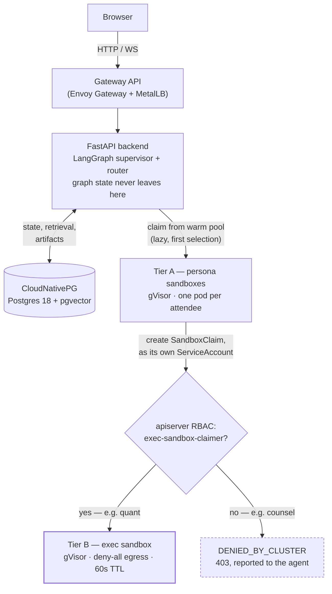

# Architecture

The system in one property: a meeting turn crosses three trust boundaries —
backend, persona sandbox, exec sandbox — and what a given persona may do at
each one is decided by Kubernetes objects, not by the prompt. This document is
the consolidated reference for how the pieces fit together. For narrower
questions, see the companion docs:

- [`learning-path.md`](learning-path.md) — the same material read as a
  curriculum, one stage per phase, each with the command that proves its
  claim.
- [`sandbox-security-model.md`](sandbox-security-model.md) — how each
  isolation tier was verified, and the fallback ladder for hosts without
  gVisor.
- [`verify-enforcement.md`](verify-enforcement.md) — the exact commands that
  produce the enforcement table below; re-run them after changing a profile.
- [`demo-script.md`](demo-script.md) — a presentation-paced walkthrough that
  provokes each of these claims live.

## System overview



Two design rules make this coherent, and neither is negotiable in an
extension of the system:

1. **The LangGraph graph never leaves the backend.** Sandboxes are turn
   executors, not graph participants. Distributed checkpointing across
   sandboxes is a research project, not a demo requirement — see
   `backend/app/orchestration/agents.py`, whose docstring records that a
   remote ReAct loop cost one round trip per turn precisely because
   individual tool calls are not RPC'd back to the backend.
2. **Sandboxes never hold the application database credential.** Everything
   a persona sandbox needs goes through a scoped internal API back to the
   backend; the one exception is a read-only DSN for a separate metrics
   schema, mounted only into profiles that are granted it.

## Namespaces

| Namespace | Holds | Notes |
|---|---|---|
| `meetings` | Backend, frontend, Gateway, CloudNativePG cluster | Holds the application database credential. Nothing here is gVisor-isolated because nothing here runs untrusted code. |
| `meetings-sandboxes` | Tier A — one persona pod per attendee, warm-pooled per profile | Each pod's ServiceAccount (`persona-<profile>`) is what RBAC and NetworkPolicy actually key on. |
| `meetings-exec` | Tier B — the `exec-python` warm pool | Deny-all egress. Only reachable via a SandboxClaim a Tier A pod creates against its own ServiceAccount. |

Defined in [`deploy/charts/meetings/templates/namespaces.yaml`](../deploy/charts/meetings/templates/namespaces.yaml).

## The turn sequence

```mermaid
sequenceDiagram
    participant S as Supervisor (backend)
    participant M as SandboxManager
    participant P as Persona pod (Tier A)
    participant K as apiserver (RBAC)
    participant E as Exec pod (Tier B)

    S->>M: claim warm persona-&lt;profile&gt; pod
    Note right of M: lazy — on first selection,<br/>not at meeting start
    M->>P: bind persona (once per meeting)
    S->>P: issue turn (W3C traceparent propagated)
    P->>P: ReAct loop against the model

    opt agent calls run_python_analysis
        P->>K: create SandboxClaim, as persona-&lt;profile&gt; SA
        alt profile has can_execute_code
            K-->>P: 200 — claim granted
            P->>E: POST /run { code } (traceparent propagated again)
            E-->>P: stdout / chart artifact — no egress attempted
        else profile lacks can_execute_code
            K-->>P: 403 Forbidden
            P-->>P: DENIED_BY_CLUSTER — reported to the agent, not raised
        end
    end

    P-->>S: utterance + tool audit trail
    S->>S: map into graph state, write transcript
```

A few details that don't survive being summarized further:

- **Acquisition is lazy.** A five-person meeting where two attendees never
  speak should not hold five pods — the claim happens on the supervisor's
  first selection of that attendee, not at meeting start
  (`backend/app/sandbox/manager.py`).
- **The Tier B claim is made by the persona pod itself**, using the
  ServiceAccount token already mounted into it — the backend is not in this
  path and cannot broker around the RBAC decision on a persona's behalf
  (`sandbox/runtime/runtime/tools/code_exec.py`).
- **A denial is reported, not raised.** `run_python_analysis` catches the
  403, returns `DENIED_BY_CLUSTER: ...` as a normal tool result, and the
  agent carries on contributing. This is what makes the denial show up in
  the transcript and the audit matrix as a policy decision, rather than
  crashing the turn.
- **The trace survives all three hops.** The `traceparent` header is
  propagated over the sandbox RPC and again when a persona pod claims an
  exec sandbox, so one turn renders as one trace spanning all three trust
  boundaries — the basis for the three-tier tracing shipped in Phase 5
  (`backend/app/core/telemetry.py`).
- **Nothing durable lives in a sandbox.** If a pod dies mid-meeting, the
  backend claims another, replays the persona bind, and re-issues the turn;
  the `turn_results` table is what makes that replay safe.

## Capability profiles

A persona's requested tools resolve to the *smallest* profile that covers
them (`backend/app/orchestration/profiles.py`) — a persona that only needs to
read numbers lands in `analyst`, never in `quant`, because reading metrics is
not a reason to be handed a Python interpreter. A persona that asks for a
combination no profile provides fails meeting start with a precise
`ProfileDriftError` rather than silently losing a capability mid-meeting.

| Profile | Adds beyond baseline | Executes code | Metrics DSN | Corpus egress | Seeded as |
|---|---|:-:|:-:|:-:|---|
| `baseline` | — (retrieve, draft, read, record) | | | | — |
| `counsel` | `check_policy_compliance` | | | | General Counsel |
| `strategist` | `search_corpus` | | | ✅ | Architect |
| `analyst` | `query_business_metrics` | | ✅ | | VP |
| `quant` | metrics + `run_python_analysis` | ✅ | ✅ | | Finance Director |
| `chief` | metrics + policy + corpus | | ✅ | ✅ | CEO |

The `chief` row is deliberate, not an oversight: it is the broadest read
access of any profile and still cannot execute code. Seniority is not a
reason to hand someone a Python interpreter, and the contrast between
`chief` and `quant` is what makes the RBAC boundary legible rather than
merely a rule that happens to bind the CEO.

Every profile shares one runtime image. Nothing about the image decides what
an agent may do — only the SandboxTemplate, ServiceAccount, NetworkPolicy and
mounted Secrets its sandbox is created from.

## The five-layer enforcement model

| Layer | Control | Stops | Measured |
|---|---|---|---|
| Prompt | Only granted tools are registered | Honest mistakes | — |
| Runtime | Grant intersected with a capability file mounted from a ConfigMap | A compromised backend over-granting | `/etc/sandbox/capabilities` per pod |
| Secret | Credentials mounted only into templates that need them | Nothing to steal | absent for `baseline`/`counsel`, present for `analyst`/`quant`/`chief` |
| NetworkPolicy | Default-deny egress per profile | A stolen credential being *used* | blocked for `baseline`/`counsel`, open for `analyst`/`quant`/`chief` |
| RBAC | Only some ServiceAccounts may claim an exec sandbox | The agent itself — a 403 from the apiserver | **yes** for `quant` only, of six profiles |

Layers 3 and 4 compose: a persona with no metrics credential also has no
network route to reach Postgres, so a DSN leaked into a prompt is useless to
the wrong profile. Full verification commands and the reasoning behind each
choice — including a correction on record for a control that measured as
weaker than it looked (kindnetd accepting NetworkPolicy objects without
enforcing them) — live in
[`sandbox-security-model.md`](sandbox-security-model.md).

### Why every profile may still reach the apiserver

An earlier version blocked apiserver egress for profiles without the
code-execution grant, on the theory that it added defense in depth. It was
marginally stronger and clearly wrong: blocking the request at the network
turned a policy decision into a 60-second connection timeout, indistinguishable
from an outage. Letting the request reach the apiserver means the refusal
comes back as a fast, unambiguous 403 the agent can report and the audit
matrix can display. A denial nobody can see is a control nobody can trust.

## Platform

| Component | Choice | Why |
|---|---|---|
| Cluster | 3-node k3s on Proxmox VMs | Real nodes with their own kernels, so `runsc` is simply the runtime — no nested-VM caveats |
| Sandboxes | Agent Sandbox v0.5.6 (`agents.x-k8s.io/v1beta1`) | The emerging standard for agent isolation on Kubernetes |
| Isolation | gVisor (`runsc`), `systrap` platform | Verified via `/proc/version`, never via a readiness check — see the sandbox security model |
| Database | CloudNativePG 1.30, Postgres 18 | pgvector arrives as a declarative **ImageVolume** extension, not a custom-baked image |
| Ingress | Gateway API + Envoy Gateway + MetalLB | A real LoadBalancer address on the LAN, and the WebSocket upgrade the transcript stream needs |
| Migrations | Alembic, as a Helm pre-upgrade hook | Schema changes are explicit and reviewable, not a startup side effect |
| Tracing | OpenTelemetry, OTLP → Tempo | One `traceparent` propagated across all three trust boundaries per turn |
| Metrics | Prometheus, scraped via `ServiceMonitor` | Low-cardinality labels — persona *profile*, not agent id |
| Dashboards | Grafana, provisioned from [`docs/dashboards/agentic-meetings.json`](dashboards/agentic-meetings.json) | Checked into the repo rather than clicked together |

## Known gap

There is no automated coverage of the frontend (`frontend/` has no test
files; backend and sandbox-runtime have 11 and 4 respectively). Acceptable
for a demo at its current scope; worth closing before Phase 6 claims
integration/e2e depth.
